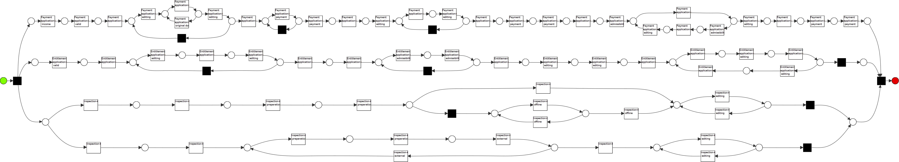

# BPI 2018: Improving merging conditions for recomposing conformance checking
##### Wai Lam Jonathan Lee, Jorge Munoz-Gama, H.M.W. Verbeek, Wil M.P. van der Aalst, Marcos Sepulveda

### TL;DR
This repository includes and details the experimental setup for the BPI paper. As such, the repository includes the following content:
- Experimental setup code 
- ProM plugin jars so that the versions are fixed for reproducibility purpose
- Datasets (nets, logs, net decomposition) used for the paper 
- Data generation and selection (synthetic and real-life)
- Experimental results 
- Jupyter notebooks used to generate the figures

### How to run experiments?
#### Overview:
To automate the experiments, ProM plugin classes are written so that parameters are passed as JSON files and calls to the actual plugin classes are made and results are recorded accordingly. For example, in the jar **2018-05-01_Recomposing_replay_boot.jar**, there is a class called ```TestRecomposingReplayWithMergeStrategyBoot``` which takes a JSON configuration file and boots the ProM plugin class ```TestRecomposingReplayWithMergeStrategy``` which in turn constructs and executes ```RecomposingReplayWithMergeStrategy```, the actual ProM plugin class.

Running the experiment by calling the executable will output results and a copy of the configuration at the designated result directory.

#### Running configured experiments
Python and Shell scripts are used to automate batched configured experiments. In the ```configs/``` directory, each experimental configuration is a separate directory. For example, consider ```configs/BPIC18/Replay/RScore-LExclude-S-M15/``` which refers to running the recomposition approach on the dataset BPIC18 using the net strategy **Balanced** and log strategy **SIC**.
There are three things:
- Runner.sh: executable to run this experiment
- toRun.txt: details the net, log dataset pairs to run, which in this case is just BPIC18 (net), BPIC18-entitlement-payment-inspection-500 (log)
- Recomposing replayer configs.json: the configuration file

We now take a closer look at the configuration file.

##### Configuration file:
It is a JSON file that looks like this:
```
{
  "basedir": "..",
  "result_dir": "results",
  "data_to_run": "configs/BPIC18/Replay/RScore-LExclude-S-M15/toRun.txt",
  "experiment_name": "BPIC18_R_score_L_exclude_S_M15",

  # GB of memory allocated to ProM jar executable
  "memory": 6,
  "prom_jar": "ProM651.jar",
  # the jar containing the boot class
  "plugin_jar": "2018-05-01_Recomposing_replay_with_merge_strategy_boot.jar",
  "prom_pkg": "ProM651_lib",
  # the boot class to run recomposing conformance checking
  "main_class": "org.processmining.decomposedreplayer.experiments.boot.TestRecomposingReplayWithMergeStrategyBoot",
  "model_ext": "apnml",
  "log_ext": "xes.gz",

  # parameters for the ProM plugin class
  "is_monolithic": false,
  "replay_config": "Decompose",
  "move_on_log_costs": 10,
  "move_on_model_costs": 4,
  # millis
  "global_duration": 1800000,
  "local_duration": 80000,
  many more plugin specific parameters, you get the idea...
}
```
#### Default recomposition configuration
| Parameters | Values | Notes |
|---|---|---|
| MoveOnLogCosts | 10 | |
| MoveOnModelCosts | 4 | |
| InitialDecomposition | SESE-based (max arcs: 25) or Maximal | SESE-based is used for the synthetic datasets and Maximal is used for the real-life dataset |
| HideAndReduceAbstraction | True | |
| GlobalDurationThreshold | 900 or 1800 seconds | 1800 seconds is used for the real-life dataset |
| LocalDurationThreshold | 80 seconds | |
| RelativeIntervalThreshold | 100% | |
| AbsoluteIntervalThreshold | 0 | | 
| MaxConflictThreshold | 100 | |
| AlignmentPercentageThreshold | 100% | |
| MaxIterationThreshold | 200 | |
| Memory allocated to ProM | 6G | |

### Data generation and selection
#### Synthetic datasets
To evaluate the proposed recomposition strategies synthetic datasets are used. The generation of the synthetic datasets is performed using the PTandLogGenerator (cited in paper) and reproducible as a RapidProM (cited in paper) workflow.
##### Model generation
Concretely, five Petri nets are generated from a triangular distribution with parameters {150, *k*, 300} where *k* is varied from 180 to 260 in steps of 40. The base distribution of sequential, exclusive choice, parallel, and loop constructs are 46%, 35%, 10%, and 9% respectively. This estimated distribution is based on the percentage of process models that contain such constructs found in the study (cited in paper). In the study, the percentage of loop construct is not included. In order to include loop construct for the experiments, portion of the parallel construct percentage is allocated to loop construct percentage, so that 9% of the originally 19% of parallel constructs is reallocated to loop constructs.
##### Log generation
For each Petri net model, four event logs are generated. All logs have 1000 cases and contains noises of different profiles. Noise characteristics are configured by varying the *noise percentage* (noise occurrence), i.e., the probability that noise will occur, and *event percentage* (noise spread), i.e., the percentage of events in a trace that noise will be applied to. The four noise configurations are created by all the combinations of low, i.e., 10%, and high, i.e., 60%, configurations of the noise occurrence and noise spread.

#### Real-life dataset
The BPIC18 dataset is used as the real-life dataset. However, due to the size of the event log and the absence of a normative model, analysis is done on the event data involving three sub-processs, namely, the Entitlement, Payment, and Inspection document types, and descriptive models discovered using inductive miner. 

The following steps are done to create the corresponding event log which has 500 cases and the Petri net model:
1. The full event log is filtered to include only traces of length 100 to 500 events since we are interested in getting a larger log and model.
2. The log is filtered by document types to get the events involved with the document types: entitlement application, payment application, remote inspection and onsite inspection. In total, four filtered event logs are created. Moreover, to avoid discovering spaghetti models, several less important and spaghetti prone activities, e.g., insert + delete documents, are filtered out. Also, less frequent paths are also filtered out. All the standard preprocessings are done manually using Disco.
3. Corresponding models are then mined from the filtered logs.
4. After inspecting the full event log, it seems that the entitlement application and payment application can be concurrently executed while inspection comes after the two document types. As such, the four models (entitlement, payment, remote inspection, and onsite) are joined together. Similarly, the corresponding event log involving all four document types is created. 
5. To keep replay time reasonable, 500 cases are sampled from the log from Step 4.

##### Mined Petri net model


